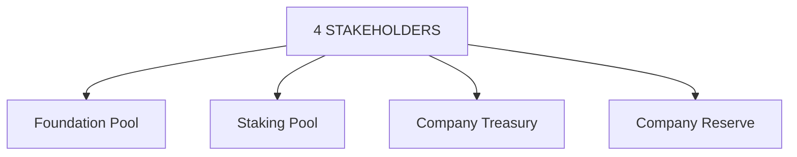

# Our Stakeholders

SkyFleetDash has established a four-stakeholder model to ensure the success of the platform and the equitable distribution of revenue. Through smart contracts, revenues generated on the platform will be allocated across these four stakeholders to support the growth of both the creator and player ecosystems, as well as to provide the necessary resources to develop high-quality gaming experiences.

### Foundation Pool

The Foundation Pool ensures that a portion of the revenue generated by SkyFleetDash is redistributed to support ecosystem growth. Funds from this pool are used to incentivize game creators, developers, and community-driven projects. Over time, the Foundation Pool will be progressively decentralized, transitioning to a DAO-driven model to allow the community to have a greater say in how these resources are allocated.

### Staking Pool

The Staking Pool is designed to reward SFDT holders who stake their tokens. Players who actively lock their tokens in smart contracts will earn additional yield, providing passive income while supporting the platform's stability. The governance of the Staking Pool will initially be managed centrally but will migrate to a DAO mechanism over time, ensuring that the community has control over staking rewards and distribution.

### Company Treasury

The Company Treasury represents the portion of SFDT generated through the sale of company-owned assets. Funds held in the treasury will be used to cover operational expenses and will be subject to a lock-up period to ensure the long-term sustainability of the platform. Once unlocked, these tokens will be sold back to the market, ensuring liquidity while maintaining the value of SFDT.

### Company Reserve

The Company Reserve represents 15% of the total token supply (150 million SFDT). These tokens are locked for a minimum of six months, managed by a multisig wallet (3-of-5 signers required), and governed by DAO proposals once governance is activated. The reserve supports long-term projects, partnerships, and emergency funding, ensuring that SkyFleetDash has the resources to scale sustainably.
