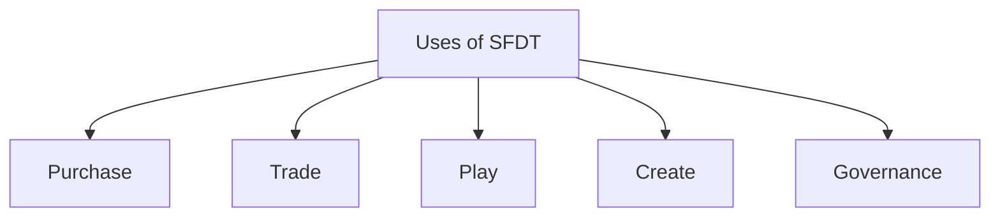

# Use Case for SkyFleetDash Token (SFDT)

SkyFleetDash Token (SFDT) offers players a versatile utility that enhances their gameplay experience, facilitates trade, and provides governance rights. Through SFDT, players and creators can access a wide range of features, transforming their participation in the platform into a rewarding and dynamic experience.

### Purchase

Players can use SFDT to purchase various in-game services, including avatar upgrades, exclusive game modes, and special access to high-stakes tournaments. This access to premium content allows players to customize their gaming experience, enhancing their competitiveness and enjoyment.

### Trade

Players can buy, sell, and trade spaceships, cosmic gear, weaponry, and other valuable items directly within the SkyFleetDash marketplace. Additionally, players can acquire special materials and resources for crafting new assets or upgrading existing ones, providing endless possibilities for personalization and strategic advantage.

### Play

Players use SFDT to enter high-stakes multiplayer tournaments or to unlock new game modes. Players can also earn SFDT as rewards for victories and achievements.

### Create

For creators, SFDT offers a pathway to monetize their creativity. Users can design custom game content, such as spaceships, avatars, equipment, and even entire game environments, which can then be tokenized and sold within the SkyFleetDash marketplace. This system allows creators to turn their designs into valuable assets, benefiting both creators and players.

### Governance

It embraces a player-driven governance model powered by SFDT. Token holders have the right to vote on key decisions that shape the platform, including feature implementations, system upgrades, and major development plans. Players can also stake their SFDT to earn passive income and strengthen their governance influence, ensuring that the most committed participants have a voice in the platform's future. In addition to governance, SFDT enables curation, allowing players to participate in content review and quality control within the ecosystem. This player-driven curation ensures a diverse, high-quality marketplace, where players can discover new assets and experiences.
